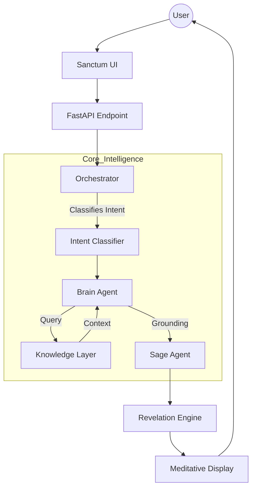

# 01 System Overview: Ramayana AI — Sanctum V1

## Project Vision
Ramayana AI — Sanctum is a "Mythology Intelligence Platform" designed to provide deep, contemplative access to the wisdom of the Ramayana. Unlike traditional chatbots that prioritize speed and utility, Sanctum is built to facilitate reflection and spiritual resonance.

## Product Philosophy
The core philosophy is **"Sit → Ask → Reflect"**. The system is designed to feel like entering a sacred space.
*   **The Sage Persona:** AI interactions are framed as revelations from a Sage, not standard LLM responses.
*   **Sequential Revelation:** Wisdom is revealed slowly and paced for contemplation.
*   **Sacred Aesthetic:** The UI uses a "Temple Aesthetic" with gold accents, dark themes, and reactive animations.

## Sanctum V1 Architecture
The architecture follows a modular, agentic approach that separates intent detection, retrieval, grounding, and formatting.

## Core User Journey
1.  **Entering the Sanctum:** User enters the dark, gold-themed interface with floating particles.
2.  **Whispering a Query:** User types a question (e.g., "What is Rama's duty?").
3.  **Contemplation:** The UI enters a 'Thinking' state where the Sage "contemplates the eternal."
4.  **Sequential Revelation:** The answer is revealed in four distinct parts:
    *   **Reflection:** A poetic opening connecting the user's query to the epic's essence.
    *   **Meaning:** The core answer derived from scriptural context.
    *   **Context:** Specific Kanda and verse references.
    *   **Takeaway:** A practical life lesson for the user.
5.  **Journey Tracking:** The Timeline Explorer updates to show where in the Ramayana this wisdom originated.

## Component Interactions
*   **User → Frontend:** User submits query via `SanctumChat.tsx`.
*   **Frontend → API:** `POST /api/sanctum` sends the raw query.
*   **API → Orchestrator:** `orchestrator.py` routes the query to Factual, Moral, or Personal agents.
*   **Orchestrator → Brain:** `brain.py` retrieves scriptural context from Qdrant and prepares relationship paths via `EntityExtractor.py`.
*   **Brain → Sage:** `sage.py` takes the synthesized data and formats it into the 4-part Revelation structure.
*   **Sage → UI:** The JSON response is parsed by the frontend, which handles the staggered animation reveal.
