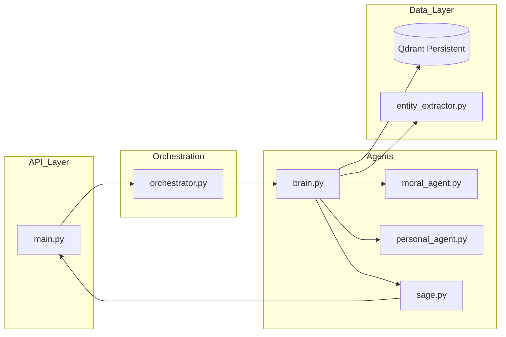

# 02 Backend Architecture: Ramayana AI

## Overview
The backend is built using **FastAPI** (Python 3.12+). It serves as the orchestration layer for the Mythology Intelligence Platform, handling data ingestion, retrieval, and multi-agent synthesis.

## FastAPI Structure
The project follows a modular package structure:
*   `backend/app/main.py`: Entry point, API routes, and lifecycle events.
*   `backend/app/agents/`: Specialized AI agents (Orchestrator, Brain, Sage, Moral, Personal).
*   `backend/ingest/`: Unified pipeline for processing CSV, JSON, and TXT sources.
*   `backend/app/core/`: (Implicit) Core utilities like entity extraction and relationship mapping.

## Architecture Diagram

## Execution Flow
1.  **Startup:** The `startup_event` in `main.py` initializes the `IngestionPipeline`, which populates the persistent Qdrant store if empty.
2.  **Request Handling:**
    *   `sanctum_query` receives a `QueryRequest`.
    *   `Orchestrator.route_query` determines if the query is `factual`, `moral`, or `personal`.
    *   `BrainAgent.retrieve_context` performs a hybrid search:
        1.  Exact entity match (via metadata filters).
        2.  Semantic search (via SentenceTransformers).
    *   `BrainAgent.synthesize_response` merges context and routes to specialized agents.
    *   `SageAgent.get_full_response` structures the output into the Revelation schema.
3.  **Logging:** Queries are logged to `backend/logs/observability.jsonl` with latency and entity metadata.

## Ingestion Pipeline
The `IngestionPipeline` (`pipeline.py`) uses a modular loader system:
*   `ShlokaLoader`: Parses Valmiki JSON shlokas.
*   `CSVLoader`: Handles large-scale CSV datasets.
*   `KandaLoader`: Processes Kanda-specific summaries.
*   `TXTLoader`: Parses raw Griffith translation text using BOOK-to-Kanda mapping.
*   `KnowledgeBuilder`: Enriches metadata with pre-extracted entities.

## LLM and Prompt Layer
*   **Embeddings:** `all-MiniLM-L6-v2` via `sentence-transformers`.
*   **Retrieval Store:** Qdrant (local persistent mode).
*   **Prompting:** Logic is currently hardcoded into the agent `synthesize` methods to ensure deterministic, poetic formatting ("The Thread of Fate", "In the depths of the sacred verses...").
