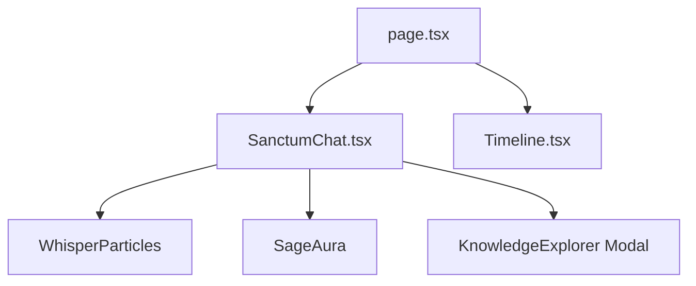

# 03 Frontend Architecture: Sanctum UI

## Overview
The frontend is a **Next.js 15** application (using React 19) designed for a meditative, immersive user experience. It leverages **Framer Motion** for sequential content revelation and **Tailwind CSS** for the "Temple Aesthetic."

## Project Structure
*   `frontend/src/app/page.tsx`: Main entry point.
*   `frontend/src/app/components/SanctumChat.tsx`: Core chat interface and revelation engine.
*   `frontend/src/app/components/Timeline.tsx`: Journey explorer and Kanda visualization.
*   `frontend/src/app/layout.tsx`: Root layout with font optimization (`display: swap`).

## Component Interactions


## State Flow and Sage Transitions
The `SanctumChat` component manages the system state, which drives the visual "Sage Aura" and animations.

| State | Visual Cues | Transition Trigger |
| :--- | :--- | :--- |
| `idle` | Low opacity aura (15%), floating particles | Default / Reveal cycle complete |
| `thinking` | Amber pulse (30% opacity), loading indicator | User submits query |
| `revealing` | Highest opacity aura (40%), sequential text reveal | API returns response |
| `speaking` | Pulse intensity reduces (25% opacity) | Revelation animations finish (~8.5s) |

## Revelation Engine
The revelation engine is implemented via `RevelationSection` and `SourceAttribution` sub-components within `SanctumChat.tsx`. It uses a centralized `REVELATION_TIMINGS` constant:

```typescript
const REVELATION_TIMINGS = {
  REFLECTION: 0.5,
  MEANING: 2.5,
  CONTEXT: 4.5,
  TAKEAWAY: 6.5,
  SOURCES: 8.5,
  TOTAL_DURATION: 15000
};
```

### Staggered Animations
Each section uses a unique `delay` based on its type:
1.  **Reflection:** Appears at 0.5s.
2.  **Meaning:** Appears at 2.5s.
3.  **Context:** Appears at 4.5s.
4.  **Takeaway:** Appears at 6.5s.
5.  **Sources:** Appears at 8.5s (along with entity buttons).

## Timeline Explorer
The `Timeline.tsx` component highlights the active Kanda based on metadata from the backend (`activeKanda`). It fetches dynamic summaries and key events from `/api/timeline`.

## API Layer
Standardized `fetch` calls are used within `handleSubmit` and `handleEntityClick` hooks. Responses are expected in the `QueryResponse` format defined in the Backend API reference.
