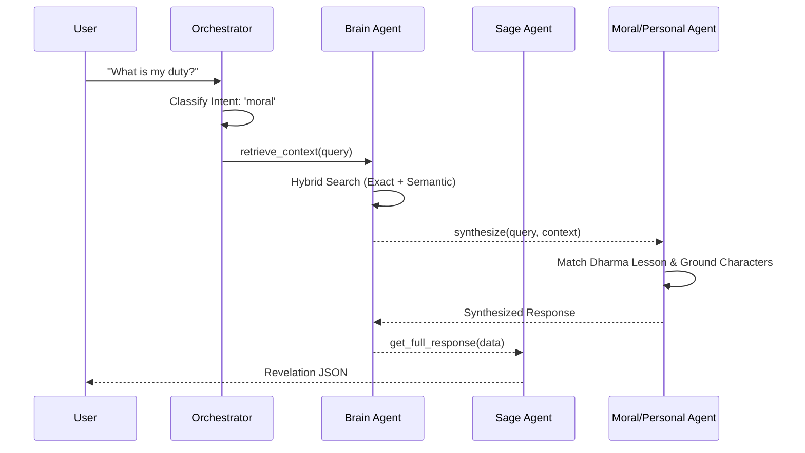

# 05 Agent System: Orchestration and Synthesis

## Overview
Sanctum V1 employs a multi-agent architecture where a central orchestrator routes user queries to specialized intelligence units.

## Orchestrator (`orchestrator.py`)
**Purpose:** Classifies the user's intent to route to the correct agent.
*   **Logic:** Uses a keyword scoring system with a priority hierarchy: **Personal > Moral > Factual**.
*   **Intents:**
    *   `personal`: Self-reflection, emotional seeking (e.g., "I feel lost").
    *   `moral`: Ethics, Dharma, lessons (e.g., "What is the lesson of Vali?").
    *   `factual`: History, characters, locations (e.g., "Who is Rama?").

## Brain Agent (`brain.py`)
**Purpose:** The central retrieval and context synthesis engine.
*   **Inputs:** Raw query, intent.
*   **Outputs:** Synthesized context, metadata (entities, verses, sources), and pathfinding results.
*   **Key Feature:** **Thread of Fate**. If two characters are detected, it performs a BFS search to find their scriptural connection and formats it poetically.

## Sage Agent (`sage.py`)
**Purpose:** The "Revelation Engine" formatter.
*   **Inputs:** Synthesized data from Brain/Moral/Personal agents.
*   **Outputs:** Structured "Revelation" object (Reflection, Meaning, Context, Takeaway).
*   **Standard Response Schema:**
```json
{
  "answer": "...",
  "agent": "Moral Agent",
  "intent": "moral",
  "revelation": {
    "reflection": "...",
    "meaning": "...",
    "context": "...",
    "takeaway": "..."
  },
  "meta": { ... }
}
```

## Moral Agent (`moral_agent.py`)
**Purpose:** Deep grounding of scriptural ethics.
*   **Logic:** Matches query against `dharma_lessons.json`. It "grounds" the lesson by weaving specific character names from the retrieved context into the final takeaway.

## Personal Agent (`personal_agent.py`)
**Purpose:** Providing contemplative emotional support.
*   **Logic:** Detects emotional cues (lost, sad, fear) and adapts the "Reflection" section to provide a supportive, scriptural-based resonance.

## Agent Sequence Diagram


## Future Roadmap
*   **V1.5:** Multi-turn conversational memory for the Personal Agent.
*   **V2.0:** Multi-agent reasoning (agents "debating" a moral dilemma).
*   **V2.0:** LLM-based intent refinement for more nuanced classification.
