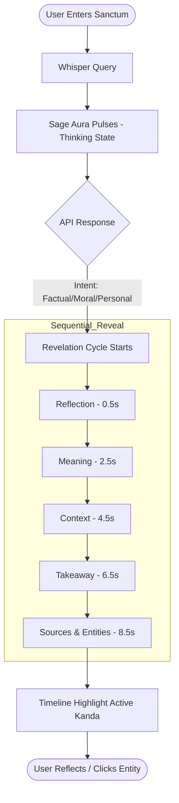

# 10 Frontend User Flow: The Seeker's Journey

## User Flow Diagram
The following diagram illustrates the transition from a user's initial inquiry to the final meditative revelation.

## Step-by-Step Breakdown

### 1. The Inquiry
The user submits a question via the chat bar at the bottom of the Sanctum. The input field is disabled during processing to maintain the meditative pace.

### 2. Contemplation (Thinking)
The UI enters a `thinking` state.
*   The **Sage Aura** (a blurred gold circle in the background) increases in opacity.
*   **Whisper Particles** move slightly faster.
*   The loading text *"The Sage is contemplating the eternal..."* appears.

### 3. The Revelation
The backend returns a `Revelation` object. The frontend does not show it all at once.
*   **Reflection:** Frames the query in a scriptural context.
*   **Meaning:** Provides the actual answer.
*   **Context:** Validates the answer with Book/Verse references.
*   **Takeaway:** Offers a transformative application for the user's life.

### 4. Journey Anchoring
As the text is revealed, the **Timeline Explorer** at the bottom of the page scrolls or highlights the Kanda from which the revelation was retrieved. This anchors the abstract wisdom in the narrative journey of the Ramayana.

### 5. Deep Exploration
The user can click on individual entity tags (e.g., "Hanuman", "Lanka") in the source attribution section. This opens a modal window showing:
*   The entity's canonical description.
*   Their "Divine Relations" (e.g., "Son of the Wind").
