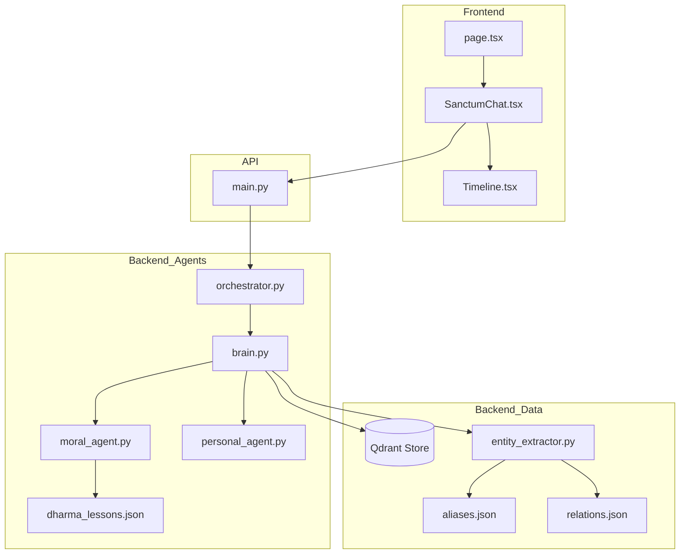

# 14 Codebase Map: Sanctum Architecture

## Project Tree
```text
.
├── backend/
│   ├── app/
│   │   ├── agents/
│   │   │   ├── brain.py         # Main retrieval & synthesis logic
│   │   │   ├── moral_agent.py   # Grounded ethics synthesis
│   │   │   ├── orchestrator.py  # Intent routing
│   │   │   ├── personal_agent.py# Emotional resonance synthesis
│   │   │   └── sage.py          # Revelation object formatter
│   │   ├── ingestion/
│   │   │   ├── base_loader.py   # Abstract loader interface
│   │   │   ├── entity_extractor.py # Alias & Pathfinding logic
│   │   │   ├── pipeline.py      # Unified ingestion entry point
│   │   │   └── ...              # Specific loaders (CSV, JSON, TXT)
│   │   └── main.py              # FastAPI server & routes
│   ├── data/                    # Scriptural sources
│   └── knowledge/               # Static entity & lesson mappings
└── frontend/
    └── src/app/
        ├── components/
        │   ├── SanctumChat.tsx  # Main UI & Revelation Engine
        │   ├── Timeline.tsx     # Journey tracker
        │   └── ...              # Visual effects (Particles, Aura)
        └── page.tsx             # Root page
```

## Major File Dependencies and Consumers

### 1. `brain.py`
*   **Purpose:** Orchestrates the retrieval process and merges knowledge.
*   **Dependencies:** `QdrantClient`, `SentenceTransformer`, `EntityExtractor`, `MoralAgent`, `PersonalAgent`.
*   **Consumers:** `main.py` (via `sanctum_query` endpoint).

### 2. `entity_extractor.py`
*   **Purpose:** Resolves aliases and finds relationship paths.
*   **Dependencies:** `backend/knowledge/aliases.json`, `backend/knowledge/relations.json`.
*   **Consumers:** `brain.py`, `metadata_builder.py`.

### 3. `SanctumChat.tsx`
*   **Purpose:** Manages the visual state of the Sage and handles user input.
*   **Dependencies:** `framer-motion`, `Timeline.tsx`.
*   **Consumers:** `page.tsx`.

## Dependency Diagram


## Architectural Weaknesses & Tech Debt
1.  **Hardcoded Synthesis:** Many poetic phrases are hardcoded in agent classes. These should ideally move to `backend/knowledge/templates.json`.
2.  **BFS Pathfinding:** The relationship pathfinder in `entity_extractor.py` uses an in-memory BFS on a small JSON list. This will not scale to thousands of relationships without a Graph DB.
3.  **Client-Side Timings:** Revelation delays are managed via `setTimeout` in the frontend. This could lead to desync if the tab is throttled or the network is extremely slow.
4.  **No User Auth:** The Sanctum is currently a shared, stateless session. No per-user memory exists.
