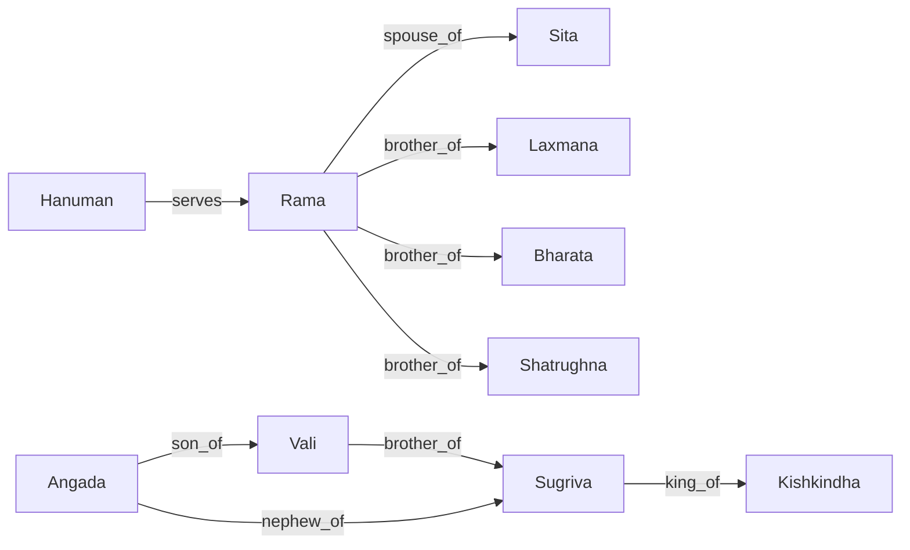

# 17 Entity Graph: Divine Connections

## Canonical Entities
The system recognizes a set of canonical names defined in `backend/knowledge/entities.json`. All variations are mapped to these names.

### Primary Character List
*   Rama
*   Sita
*   Hanuman
*   Vali
*   Sugriva
*   Angada
*   Laxmana
*   Bharata
*   Shatrughna
*   Ravana

## Alias System
Implemented in `backend/knowledge/aliases.json`. This system ensures that user queries using common variations still trigger the correct entity knowledge.

| Canonical Name | Recognized Aliases |
| :--- | :--- |
| **Vali** | bali |
| **Angada** | angadha |
| **Vashistha** | vasistha, vasista |
| **Laxmana** | lakshmana |

## Relationship Graph (Current)
The current graph is defined in `backend/knowledge/relations.json` and processed by the `EntityExtractor.find_path` function.

### Actual Relationship Map

## The "Thread of Fate" Implementation
This is a **Verified Feature**.
*   **File:** `backend/app/ingestion/entity_extractor.py`
*   **Function:** `find_path(entity1, entity2)`
*   **Logic:** Uses an in-memory Breadth-First Search (BFS) to find the shortest path between two characters in the relations graph.
*   **Synthesis:** `BrainAgent.synthesize_response` formats the path result into a poetic "Thread of Fate" description.

## Future Roadmap
*   **Dynamic Extraction:** Use NLP to extract relations directly from the 80k shlokas rather than relying on a static JSON file.
*   **Graph Database:** Migrate to Neo4j to support complex path queries (e.g., "How is Hanuman connected to Ravana's death?").
*   **N-Degree Paths:** Increase BFS depth from 2 to unlimited once a proper graph database is in place.
